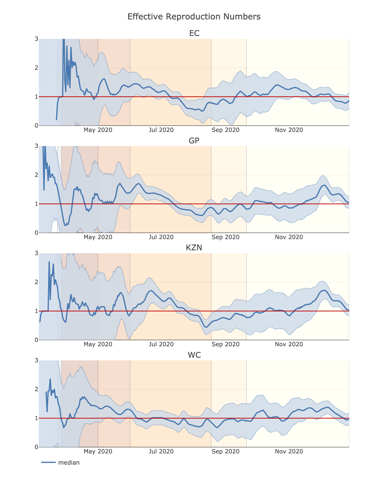

# COVID-19 Reproduction Numbers in South Africa

The goal of this project was to derive and implement a relatively simple
Bayesian model that can be used to estimate effective reproduction numbers for
an epidemic, with a particular focus on the COVID-19 epidemic in South African
provinces. The work was inspired by that of Systrom and Bettencourt and Ribeiro,
but tends towards the more analytic aspects of the Bayesian approach where
possible.

A very brief overview of the model and its solution are given in the
[summary note](doc/summary.pdf); for a full description see the
[write-up](doc/cvza.pdf).

## Notebooks

The source code should be relatively self-explanatory. An example of how to use
it to create plots is given in the [first notebook](notebooks/01-hvplot.ipynb).

## Command-line tasks

Run `make` to see a list of possible command-line operations. The two of real
interest are `make update`, which installs the required Python libraries, and
`make data`, which fetches updated versions of the data sets.
